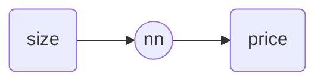
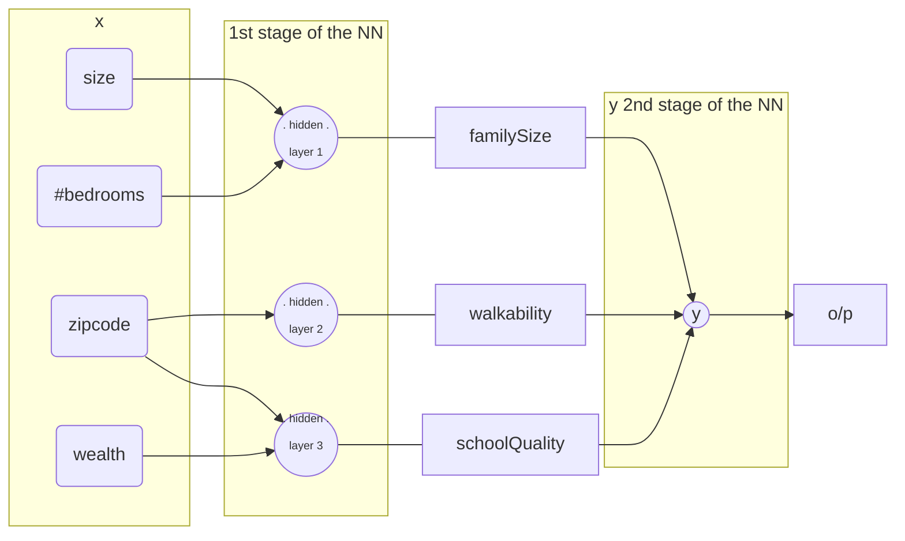

Related: 
- [[} DeepLearning.AI TensorFlow Developer Professional Certificate]]
- [[} Deeplearning.ai NLP specialization|dl.ai nlp specialisation]] 
URL: [link](https://www.coursera.org/programs/coursera-4-friends-family-cttu5/specializations/deep-learning)

- Objectives: `check if these have been acheived at the end of the course`
  - [ ] Build and train deep neural networks, identify key architecture parameters, implement vectorized neural networks and deep learning to applications
  - [ ] Train test sets, analyze variance for DL applications, use standard techniques and optimization algorithms, and build neural networks in TensorFlow
  - [ ] Build a CNN and apply it to detection and recognition tasks, use neural style transfer to generate art, and apply algorithms to image and video data
  - [ ] Build and train RNNs, work with NLP and Word Embeddings, and use HuggingFace tokenizers and transformer models to perform NER and Question Answering

## Course 1. [[Neural Network|NN]] and [[Deep learning|DL]]

> [!Note] objective
> - trends in DL, understand how DL is used for supervised learning, categories of DL and where to apply them
> - Understand the foundations of [[Neural Network]] and [[Deep learning]]

> AI is the new electricity <div class="signature"> - Andrew Ng </div>
### 1.1. Intro: 

[intro to DL lecture slides](file:///Users/asishm/Library/Mobile%20Documents/com~apple~CloudDocs/study/ML/Coursera%20DL%20/C1_W1.%20Intro%20to%20DL..pdf)
- Simple NN example: Neuron takes a `size` input and computes a linear function taking a max of zero([[Relu function]]) and outputs the estimated price

- multi stage NN example: if adding more than one stage in the neural network and having more than one input.(note that the output is still 1). The example below is of including more inputs such as size, number of bedrooms, zipcode, and wealth to estimate price


###### Examples of Supervised learning: 

| input            | Output(y)              | Application              | Model and reason                                                     |
| ---------------- | ---------------------- | ------------------------ | -------------------------------------------------------------------- |
| Home features    | Price                  | Real estate              | Standard NN                                                          |
| Ad, user info    | Click on ad?(0/1)      | Online Advertising       | Standard NN                                                                  |
| Image            | Object(1,...,1000)     | Photo tagging            | CNN |
| Audio            | Text transcript        | Speech recognition       | RNN--as audio is [[timeseries\|TS]].</br> TS & Sequence data use RNN                                                                  |
| English          | Chinese                | Machine translation      |  RNN                                                                    |
| Image,Radar info | Position of other cars | Autonomous driving(SLAM) |    Custom/Hybrid                                                                  |

Examples & representations of a couple of NN's 


Examples of structured and unstructured
**

- Why is DL taking off now:

### 1.2. Implementing [[Logistic regression|LR]] using [[Neural Network|NN]]
  
Topics skipped: Binary classification, LR: Cost function, Gradient descent

`logistic loss` = $-(y \log{\hat{y}}+(1-y)\log({1-\hat{y}}))$

LR cost function justification: 
context: In the case of 2 training examples, $\hat{y}=\sigma{(\omega^T x + b)}$ , $\hat{y}$ can be interpreted as $P(y=1|x)$ and generalizes to eqn: $P(y|x)=\hat{y}^{\ y} \times (1-\hat{y})^{1-y}$ and 
$\log{P(y|x)}=y \log{\hat{y}}+(1-y)\log{1-\hat{y}}$  which is equal to  $- \mathcal{L}(\hat{y},y)$
When training a ML model, you want to make the loss function minimal, i.e. to maximise the probability 

In the case of m [[Identically Independantly Distributed|IID]] drawn training examples, 


Vectorization : 
>Avoid using `for` loops. Use `numpy` functions for matrix operations whenever possible to make your code exponentially faster. 


$$
%psuedo code: highly inefficient non-vectorized implementation of LR
J=0, dw1=0, dw2=0, db=0
for i=1 to m:
	z(i) = w_transpose

$$

*Broadcasting in python*: doing matrix operations, python will automatically do operations such as   $\begin{bmatrix}1\\2\\3\\4\end{bmatrix}+ 100$ is automatically converted to $\begin{bmatrix}1\\2\\3\\4\end{bmatrix}+ \begin{bmatrix}100\\100\\100\\100\end{bmatrix}=\begin{bmatrix}101\\102\\103\\104\end{bmatrix}$. 


> [!note] 
> mathematically, during matrix operations, any axis of length 1 can be repeated(==broadcast==) to the other vector's length in that axis. 
> 
>  in (m,n) matrix + or - or ... (1,n) operation, (1,n) matrix is repeated m times to make a (m,n) matrix which can be added/subtracted,divided... to the 1st matrix

```python
# example: Find percentages of each macro neutrient as a part of overall food category calories
A=np.array([56,0,4,68],
		   [1.2,104,52,8],
		   [1.8,135,99,0.9]) 
cal=A.sum(axis=0)
percentage = 100*A/cal.reshape(1,4) # reshape just for convienience, actually, broadcasting will be able to take care of it. 
```
> works with `+ , - , * , ^ , min/max` and other ==elementwise== operations
> Use this instead of **for** loops. 

Having such features is a benefit in writing compact easy to understand code, but it might sometimes lead to unexpected bugs when implementing matrix ops. For eg, a vector `A` with shape`(5,)` which is a rank 1 array will behave both as a row as well as a column vector, and `A * A^T` which is supposed to be a matrix will result in a number.  

tips and tricks for python: Instead of using `a=np.random.randn(5)`, use `a=np.random.randn(5,1)` or `a=np.random.randn(1,5)` according to requirement and when in doubt, liberally use `assert(a.shape==(5,1))` which is computationally inexpensive.

* Programming assignment learnings:
	* `-1` in the reshape function means "infer the appropriate number of columns," so the reshaped array will have as many columns as needed to maintain the total number of elements.
	* 
### 1.3 Shallow Neural networks
<u>NN Recap:</u> 

<u>Computing NN output:</u>
*for a single training sample:*
Each node in a NN does 2 computations: computes `z` as shown in above equation, and computes the activation function as a sigmoid function of `z`
generalising the computations into a vector format, each layer does the following computation: 
$Z^{[1]}={w^{[1]}}^TX+b^{[1]}$ and $a^{[1]}=\sigma(z^{[1]})$ and $a^{[1]}$ is input into the next layer computations through $Z^{[2]}={w^{[2]}}^Ta^{[1]}+b^{[1]}$ and $a^{[2]}=\sigma(z^{[2]})$
these computations are done many times across the many nodes of a NN. For a n-layer NN, 2n computations are done. 

Generalising for *multiple training samples*, we get 
$$\begin{array}{l}
  for \ i= 1\ to\ m: \\
  \ \ \ \ z^{[1](i)}=W^{[1]}x^{i}\ +b^{[1]} \\
  \ \ \ \ a^{[1](i)}=\sigma{(z^{[1](i)})} \\
  \ \ \ \ z^{[2](i)}=W^{[2]}a^{[1](i)}\ +b^{[2]} \\
  \ \ \ \ a^{[2](i)}=\sigma{(z^{[2](i)})} \\
  \ \ \ \ \ \ \ \ \ \ \ \ \ \ \vdots \\
  \ \ \ \ \ \ \ and \ so \ on. \\
  Which\  can\  be\  represented\  using\  matrices\   as   \\
  \ \ \ \ Z^{[1]}=W^{[1]}X+b^{[1]} \\
  \ \ \ \ A^{[1]}=\sigma(Z^{[1]}) \\
  \ \ \ \ Z^{[2]}=W^{[2]}A^{[1]}+b^{[2]} \\
  \ \ \ \ A^{[2]}=\sigma(Z^{[2]}) \\
   
\end{array}$$
where algebraically,
$X=\begin{bmatrix}\vdots & \vdots & &\vdots \\ X^{[1]}&X^{[2]}& \dots&X^{[m]} \\ \vdots & \vdots & &\vdots \end{bmatrix}$, $Z^{[1]}=\begin{bmatrix}\vdots & \vdots & &\vdots \\ Z^{[1](1)}&Z^{[1](2)}& \dots&Z^{[1](m)} \\ \vdots & \vdots & &\vdots \end{bmatrix}$ and $A^{[1]}=\begin{bmatrix}\vdots & \vdots & &\vdots \\ a^{[1](1)}&a^{[1](2)}& \dots&a^{[1](m)} \\ \vdots & \vdots & &\vdots \end{bmatrix}$ . 


>[!Note] Note
>Note that number of training samples determines number of columns and number of hidden layers determines number of rows.  
>For a validation of the NN computation logically, just walk through the matrix dimensions across the computation. 

Instead of the `sigmoid` function $\sigma$, the activation function can be anything else as well. Such as: 


*different activation functions can be used:* 
1. sigmoid function $\sigma(z)$ : best used when you need to do logistic regression, as output is in range of 0 to 1
	1. $\sigma'(z)=\sigma(z)*(1-\sigma(z))$
2. hyperbolic tangential function `tanh` : better than sigmoid because it goes from -1 to 1 and sometimes its better to have input variables be normalised with mean 0
	1. $\tanh'(z)=1-{\tanh(z)}^2$
3. Rectified Linear Unit function `ReLU` : most commonly used. 
	1. $g(x)=max(0,x)$ & $g'(x) = \begin{cases}  0&\text{if } z<0 \\ undefined & \text{if } z=0\\1 &\text{if } z>0\end{cases}$ but approximating is fine, $g'(x) = \begin{cases}  0&\text{if } z<0 \\1 &\text{if } z\geq 0 \end{cases}$
4. Leaky Relu : Technically better than ReLU, but most often not used. 
	1. $g(z)=max(0.01z,z)$ & $g'(x) = \begin{cases}  0.01&\text{if } z<0 \\1 &\text{if } z\geq 0 \end{cases}$

***Implementing [[Gradient descent]] for NN with 1 layer:*** 
parameters: $W^{[1]}, b^{[1]}, W^{[2]}, b^{[2]}$ and will have dimensions $(n^{[1]},nn^{[0]}),(n^{[1]},1),(n^{[2]},n^{[1]}),(n^{[2]},1)$ respectively. 
input features $n_x=n^{[0]}$, $n^{[1]}$ hidden units, $n^{[2]}$ output units
cost function: $J( W^{[1]}, b^{[1]}, W^{[2]}, b^{[2]})=\frac{1}{m} \sum_{i=1}^m \mathcal{L}(\hat{y},y)$.     (note: $\hat{y}$ is nothing but $a^{[2]}$)
Gradient descent can be performed to train the paramters of your algo. When training NN, its important to initialize parameters **randomly**, rather than to 0. 
trying out call outs 

>[!Note] Why random initialization?
>Essentially when initiating weights with 0's, functions along the layer will be the same(or the weights matrix W is symmetric horizontally), and even after each iteration of forward and backward prop, you end up with  the same function. This does not lead to a very good result. 
>Instead: $W^{[1]}=\text{np.random.randn}((2,2))*0.01$ and $b^{[1]}=\text{np.zeros}((2,1))$ are used for random initiation. `b` initiated to 0 does not matter when `W` is not initiated to zeros


*algo pseudo logic:* 
Repeat{
	compute predictions ($\hat{y}^i$, i = 1,2,... ,m) and then $\cal{L}$ and $J$ using fwd prop. 
	$\partial W^{[1]}=\frac{\partial J}{\partial W^{[1]}},\quad \partial b^{[1]}=\frac{\partial J}{\partial b^{[1]}},....\quad \rightarrow reverse \ prop$ 
	$W^{[1]}=W^{[1]} -\alpha \partial W^{[1]},\quad b^{[1]}=b^{[1]} -\alpha \partial b^{[1]}$, and similarly for $W^{[2]} \ and\  b^{[2]}$
	}


*formulas:* 
$$\begin{array}{l}
\text{forward propogation: } & \quad \quad
\text{backward propogation:}\\
  \ \ Z^{[1]}=W^{[1]}X+b^{[1]} & \quad \quad \partial {Z} = A^{[2]}-Y \quad \quad  Y=[y^{[1]},y^{[2]},...,y^{[m]}\\
  \ \ A^{[1]}=\sigma(Z^{[1]}) & \quad \quad \partial W^{[2]}=\frac{1}{m}\partial Z^{[2]}A^{[2]T}\\
  \ \ Z^{[2]}=W^{[2]}A^{[1]}+b^{[2]} & \quad \quad \partial b^{[2]}=\frac{1}{m}\ np.sum(\partial Z^{[2]},axis=1,keepdims=True) \quad \rightarrow 
  \text{this keeps python from outputting weird 1 dimentional arrays. keepdims reshapes the output array} \\
  \ \ A^{[2]}=\sigma(Z^{[2]}) & \quad \quad \partial Z^{[1]}=W^{[2]T}\partial Z^{[2]} * {g^{[1]}}^{\prime}(Z^{[1]})\quad \rightarrow \text{'*' represents elementwise product, as both } W^{[2]T}\partial Z^{[2]} \ and \ {g^{[1]}}^{\prime}(Z^{[1]}) \text{ are } (n^{[1]},m) \  \text{matrices} \\ & \qquad \partial W^{[1]}=\frac{1}{m}\partial Z^{[1]}X^T\\ & \qquad \partial b^{[1]}=\frac{1}{m}\ np.sum(\partial Z^{[1]},axis=1,keepdims=True) \rightarrow \text{here the keepdims=True matters more as } dZ^{[1]} \text{has a higher chance of giving matrices of rank} (n^{[1]},)
  
\end{array}$$

*intuition for formulas(screenshots):* 
	1 layer:2layer:  Summary $\leftarrow \rightarrow$ vectorized implementation: 
	note: this is the same as the formulas mentioned above 


### 1.4 Deep Neural networks

lecture notes PDF [link](https://community.deeplearning.ai/uploads/short-url/89tSibHAcuXwW3ZFBpsnt6Yyquh.pdf)

*Deep L-layer neural network:*

A Neural network with many hidden layers are called deep neural networks. number or layers can be another hyperparameter to tune. DL community has learnt over the past few years that there are functions that deep NN's can learn that shallow NN's cant learn
note: dont count input layer $x_1,x_2,x_3$. 
notation: 

$n^{[l]}=\#\ of \ units\  in \ layer \ l$
$a^{[l]}$= activations in layer $l$ = $g^{[l]}(z^{[l]})$
$w^{[l]}$= weights for $z^{[l]}$
$x=a{[0]}\ and\ \hat{y}=a^{[l]}$

*Forward propagation in a deep network:* 
for layer l : $z^{[l]}=w^{[l]}a^{[l-1]}+b^{[l]}$ and $a^{[l]}=g^{[l]}(z^{[l]})$
vectorized: 


More on matrix dimension verification: 
	
	

generalised matrix dimensions: 
forward prop
$z^{[l]}=w^{[l]}a^{[l-1]}+b^{[l]}$ has dimensions $(n^{[l]},1)=(n^{[l]},n^{[l-1]})*(n^{[l-1]},1)+(n^{[l]},1)$

vectorized: $Z^{[l]} \ and\  A^{[l]}$ have the dimension: $(n^{[l]},m)$ and $dZ^{[l]}\ and\ dA^{[l]}$ have the same dimensions

note: though dimensions of b in vectorized form comes out to $(n^{[l]},1)$ , due to [[broadcasting]], it is expanded into $(n^{[l]},m)$. 


* *Deep vs shallow NN's:* more layers let the NN break down more basic segments of the problem to solve. eg solving edges in images, or low level audio vocalisation in audio recognition. Also, for the same formula, a shallow NN requires exponentially more nodes to. compute the same formula
* inputs and outputs for layer $l$: 
	* forward prop: 
		* input: $a^{[l-1]}$
		* output: $a^{[l]}$, cache ($z^{[l]}$)
		* 
		* 
	* backward prop: 
		* input: $da^{[l]}$
		* output: $da^{[l-1]},dW^{[l]},db^{[l]}$
		* 
	* block diagram: 
		* 
* Mathematical understanding: [blog link](https://community.deeplearning.ai/t/feedforward-neural-networks-in-depth/98811)
* Parameters vs hyperparameters: 
	* parameters: $W^{[1]},b^{[1]},W^{[2]},b^{[2]},W^{[3]},b^{[3]},...$
	* Hyperparameters: parameters that control final w and b
		* examples: learning rate $\alpha$, number of {iterations, hidden layers, hidden units, choice of activation function}, momentum, minibatch size, regularisation parameters. 
	* applied deep learning is empirical. Try with different hyparameters and adjust to get proper Cost function. proper in terms of speed of convergance, lower final convergence cost, 
	* since hyperparameters for different applications like vision, speech, NLP, ad, search dont necessarily carry over from each other. So always go emperically. 
* DL vs brain
	* 

 

 
## Course 2. Improving Deep NN: hyperparameter tuning


* Practical aspects of DL ([pdf link](https://community.deeplearning.ai/uploads/short-url/yaKFAZJs2uudFFlfProQf70Xt98.pdf))
	* Setting up ML application 
		* train/dev/test sets
			* Applied ML is highly iterative(idea->code->experiment->...). 
				* You dont know(even if you can guess based on intuition and insight) the hyperparameters from the get go. 
				* DL has been successfully applied to NLP, Vision, Speech, Structured data(Ads, search, security, logistics,...). 
				* Insight in one domain, typically does not carry over as is to other domains. 
			* Train/Dev/Test : 
				* models are trained on test set, validated on dev set, and evaluated on test. Main function of dev set is to be a quick check, eg. for multiple models trained on train sets, what is working ok, what is not, etc. 
					* Dev set also called hold out set or cross validation set. 
				* Earlier, when we had lesser data, we needed to give 20% to dev and test. With the advent of big data, we can get away with significantly smaller dev/test sets
				* Dev/test sets can be from a different data distribution than training set, but make sure dev and test are from same distribution(eg. Web scraped vs user submitted photos)
		* Bias/variance
			* Definitions: 
				* high variance: low training set error(1%) << high dev set error(11%)
				* high bias: training set error(15%) < dev set error(16%) <<< human error(assuming <1%)(bayesian error)
				* high bias and high variance: high training set error(15%) << even higher dev set error(30%)
				* low bias, low variance: low 
				* all above is based on assumption that human error(also called bayesian error) is near 0%. If not, then we will need to use some other methods discussed later
				* bias/variance visual representation
					* 
				* 
			* Handling bias/variance 
				* If you have higher bias(performing badly on training data)
					* bigger network
					* training longer(with additional optimisation algo's)
					* different Neural network architecture.
					* Check bias again.
				* If bias low, but variance is high(dev set variance is high), try:
					* Get more data
					* Regularization
					* different NN architecture
					* check bias and variance again
				* There was earlier a bias-variance tradeoff, because there were no tools that could decrease one without increasing the other. But with the solutions mentioned above(+ advent of big data era), one can be isolated while diagnosing and fixing the other.
				* 
	* ==Regularizing== our neural network
		* 
		* 
		* 
	* Setting up your optimisation problem
* Optimisation Algorithms
* Hyperparameter tuning
* Batch normalization
* muticlass classification
* Programming frameworks intro

## Course 3. Structuring your ML project


## Course  4. [[Convolutional Neural Networks]]

## Course 5. NLP: building sequence models

