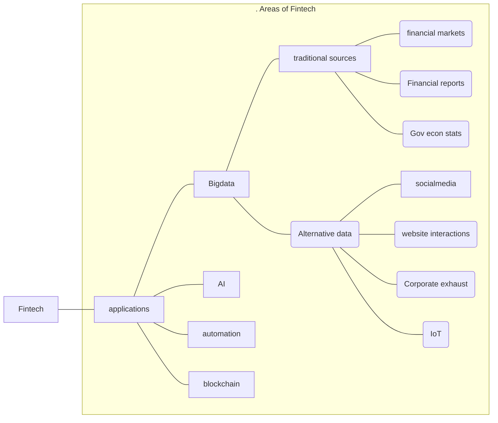

Related: [[CFA]], [[schweser cfa 5]], 
mindmap: [[portfolio management]] #mindmap

# [Book 5: Portfolio Management and Ethical and Professional Standards](zotero://open-pdf/0_X5F7WATF/2)

#### how this notes was written : 

Read through one topic while writing down terms. Then explain in your own words, looking at technical terms written.
Also, dont write down things you know very well. i.e. obvious things. 

-   [Learning Outcome Statements (LOS)](zotero://open-pdf/0_X5F7WATF/7)
	- [ ] use as a checklist after one reading 

[[sCFA1 PFM annotations]]

## [Portfolio Management: An Overview](zotero://open-pdf/0_X5F7WATF/11)

#### [1: Portfolio Management Process](zotero://open-pdf/0_X5F7WATF/11)
- portfolio perspective, diversification, Modern portfolio theory, diversity ratio, 
-“portfolio perspective”  ([pdf](zotero://open-pdf/library/items/X5F7WATF?page=11&annotation=LCQBXUXB))

“diversification allows an investor to reduce portfolio risk without necessarily reducing the portfolio’s expected return” ([pdf](zotero://open-pdf/library/items/X5F7WATF?page=11&annotation=FWU3MDGY))

“modern portfolio theory (MPT)” ([pdf](zotero://open-pdf/library/items/X5F7WATF?page=11&annotation=8YEZWRWL))

- “diversification ratio” ([pdf](zotero://open-pdf/library/items/X5F7WATF?page=11&annotation=9I75RDBL))
	- “diversification ratio is calculated as the ratio of the risk of an equally weighted portfolio of n securities (measured by its standard deviation of returns) to the risk of a single security selected at random from the n securities.”([pdf](zotero://open-pdf/library/items/X5F7WATF?page=11&annotation=KKLJPJLA)) 
	- A lower diversification ratio indicates a greater risk-reduction benefit from diversification

- “three major steps in the portfolio management process”  ([pdf](zotero://open-pdf/library/items/X5F7WATF?page=12&annotation=VXZ8UUPR)) 
	- planning, 
		- “Investment policy statement:investor's investment objectives and constraints.  
		- after analysing investor’s risk tolerance, return objectives, time horizon, tax exposure, liquidity needs, income needs, and any unique circumstances or investor preferences,” ([pdf](zotero://open-pdf/library/items/X5F7WATF?page=12&annotation=UCNG6PAV))
	- execution, 
	- feedback

- **types of investors** 

- pension plans: 
	- “defined **contribution** pension plan: investment decisions are left to the employee, who assumes all of the investment risk” ([pdf](zotero://open-pdf/library/items/X5F7WATF?page=14&annotation=CCPRVRYE))
	- “defined **benefit** pension plan: employer assumes the investment risk” ([pdf](zotero://open-pdf/library/items/X5F7WATF?page=14&annotation=8Y2GLP4R))

#### [2: Asset Management and Pooled Investments](zotero://open-pdf/0_X5F7WATF/15)
- asset management industry: buyside and sell side firms
	- buyside: firms that manage investments for clients 
	- sellside: broker dealers and investment banks 
- asset managers: 
	- full service: offers variety of investment styles and asset classes
	- specialist: focus on one investment style or asset class 
	- multi-boutique: holding company that includes number of specialist asset managers. 
- passive vs active management: 
	- active: attempt to outperform some benchmark through manager skill
	- passive: replicate performance of chosen benchmark index. 
		- traditional broad market index tracking 
		- smart beta: focus on exposure to particular market risk factor
	- passive is 1/5th, active 4/5 of [[AUM]]. 
		- however, this is changing over time, as people believe the risk adjusted returns of active managers is not great, especially when their high fees is considered.  
	- passive fees also lower than active, so revenue also lower. 
- traditional(equities, FI, etc) vs alternative(PE, hedge funds, real estate, commodities, etc)
	- profit margin higher in alt, 
- trends: data available exponentially increased, robo advisors prevalent. 
- pooled investments: single portfolio that contains investment funds from multiple investors. 
	- Mutual funds
		- net asset value(NAV) of each share: net value of assets in pool/no. of such shares issued. 
		- open end fund: investors can buy newly issued shares at NAV
		- no load funds: 
		- load funds

[Types of Mutual Funds](zotero://open-pdf/0_X5F7WATF/16)
- money market funds: 
	- short term debt securities 
	- also provide interest income
	- low risk of change in share value
	- differentiation based on money market securities purchased and average maturity 
- Bond MF
	- invest in FIS
	- differentiated by bond maturities, credit ratings, issuers, and types
- Stock MF
	- passively managed: Index funds
	- Actively managed

[Other Forms of Pooled Investments](zotero://open-pdf/0_X5F7WATF/17)

-   [Key Concepts148](zotero://open-pdf/0_X5F7WATF/18) $\rightarrow$ test yourself. out loud 😁
	- a. describe the portfolio approach to investing. 
	- b. describe the steps in the portfolio management process. 
	- c. describe types of investors and distinctive characteristics and needs of each. 
	- d. describe defined contribution and defined benefit pension plans. 
	- e. describe aspects of the asset management industry. 
	- f. describe mutual funds and compare them with other pooled investment products.

-   [Reading 49: Portfolio Risk and Return: Part I](zotero://open-pdf/0_X5F7WATF/22)
    
    -   [Exam Focus](zotero://open-pdf/0_X5F7WATF/23)
        
    -   [Module 49.1: Returns Measures](zotero://open-pdf/0_X5F7WATF/23)
        
        -   [Average Returns](zotero://open-pdf/0_X5F7WATF/23)
            
        -   [Other Return Measures](zotero://open-pdf/0_X5F7WATF/24)
            
    -   [Module 49.2: Covariance and Correlation](zotero://open-pdf/0_X5F7WATF/28)
        
        -   [Variance (Standard Deviation) of Returns for an Individual Security](zotero://open-pdf/0_X5F7WATF/28)
            
        -   [Covariance and Correlation of Returns for Two Securities](zotero://open-pdf/0_X5F7WATF/29)
            
    -   [Module 49.3: The Efficient Frontier](zotero://open-pdf/0_X5F7WATF/31)
        
    -   [Key Concepts](zotero://open-pdf/0_X5F7WATF/38)
        
        -   [LOS 49.a](zotero://open-pdf/0_X5F7WATF/38)
            
        -   [LOS 49.b](zotero://open-pdf/0_X5F7WATF/39)
            
        -   [LOS 49.c](zotero://open-pdf/0_X5F7WATF/39)
            
        -   [LOS 49.d](zotero://open-pdf/0_X5F7WATF/39)
            
        -   [LOS 49.e](zotero://open-pdf/0_X5F7WATF/40)
            
        -   [LOS 49.f](zotero://open-pdf/0_X5F7WATF/40)
            
        -   [LOS 49.g](zotero://open-pdf/0_X5F7WATF/40)
            
        -   [LOS 49.h](zotero://open-pdf/0_X5F7WATF/40)
            
        -   [LOS 49.i](zotero://open-pdf/0_X5F7WATF/40)
            
    -   [Answer Key for Module Quizzes](zotero://open-pdf/0_X5F7WATF/41)
        
-   [Reading 50: Portfolio Risk and Return: Part II](zotero://open-pdf/0_X5F7WATF/43)
    
    -   [Exam Focus](zotero://open-pdf/0_X5F7WATF/44)
        
    -   [Module 50.1: Systematic Risk and Beta](zotero://open-pdf/0_X5F7WATF/44)
        
        -   [Systematic Risk Is Relevant in Portfolios](zotero://open-pdf/0_X5F7WATF/48)
            
    -   [Module 50.2: The CAPM and the SML](zotero://open-pdf/0_X5F7WATF/53)
        
        -   [Comparing the CML and the SML](zotero://open-pdf/0_X5F7WATF/55)
            
    -   [Key Concepts](zotero://open-pdf/0_X5F7WATF/61)
        
        -   [LOS 50.a](zotero://open-pdf/0_X5F7WATF/61)
            
        -   [LOS 50.b](zotero://open-pdf/0_X5F7WATF/61)
            
        -   [LOS 50.c](zotero://open-pdf/0_X5F7WATF/61)
            
        -   [LOS 50.d](zotero://open-pdf/0_X5F7WATF/61)
            
        -   [LOS 50.e](zotero://open-pdf/0_X5F7WATF/62)
            
        -   [LOS 50.f](zotero://open-pdf/0_X5F7WATF/62)
            
        -   [LOS 50.g](zotero://open-pdf/0_X5F7WATF/62)
            
        -   [LOS 50.h](zotero://open-pdf/0_X5F7WATF/62)
            
        -   [LOS 50.i](zotero://open-pdf/0_X5F7WATF/62)
            
    -   [Answer Key for Module Quizzes](zotero://open-pdf/0_X5F7WATF/63)
        
-   [Reading 51: Basics of Portfolio Planning and Construction](zotero://open-pdf/0_X5F7WATF/65)
    
    -   [Exam Focus](zotero://open-pdf/0_X5F7WATF/65)
        
    -   [Module 51.1: Portfolio Planning and Construction](zotero://open-pdf/0_X5F7WATF/65)
        
    -   [Key Concepts](zotero://open-pdf/0_X5F7WATF/73)
        
        -   [LOS 51.a](zotero://open-pdf/0_X5F7WATF/73)
            
        -   [LOS 51.b](zotero://open-pdf/0_X5F7WATF/73)
            
        -   [LOS 51.c](zotero://open-pdf/0_X5F7WATF/73)
            
        -   [LOS 51.d](zotero://open-pdf/0_X5F7WATF/74)
            
        -   [LOS 51.e](zotero://open-pdf/0_X5F7WATF/74)
            
        -   [LOS 51.f](zotero://open-pdf/0_X5F7WATF/74)
            
        -   [LOS 51.g](zotero://open-pdf/0_X5F7WATF/74)
            
        -   [LOS 51.h](zotero://open-pdf/0_X5F7WATF/74)
            
    -   [Answer Key for Module Quizzes](zotero://open-pdf/0_X5F7WATF/75)
        
-   [Reading 52: The Behavioral Biases of Individuals](zotero://open-pdf/0_X5F7WATF/76)
    
    -   [Exam Focus](zotero://open-pdf/0_X5F7WATF/76)
        
    -   [Module 52.1: Cognitive Errors vs. Emotional Biases](zotero://open-pdf/0_X5F7WATF/76)
        
        -   [Cognitive Errors: Belief Perseverance](zotero://open-pdf/0_X5F7WATF/77)
            
        -   [Cognitive Errors: Information-Processing Biases](zotero://open-pdf/0_X5F7WATF/79)
            
    -   [Module 52.2: Emotional Biases](zotero://open-pdf/0_X5F7WATF/81)
        
    -   [Key Concepts](zotero://open-pdf/0_X5F7WATF/86)
        
        -   [LOS 52.a](zotero://open-pdf/0_X5F7WATF/86)
            
        -   [LOS 52.b](zotero://open-pdf/0_X5F7WATF/86)
            
        -   [LOS 52.c](zotero://open-pdf/0_X5F7WATF/87)
            
    -   [Answer Key for Module QUIZZES](zotero://open-pdf/0_X5F7WATF/87)
        
-   [Reading 53: Introduction to Risk Management](zotero://open-pdf/0_X5F7WATF/89)
    
    -   [Exam Focus](zotero://open-pdf/0_X5F7WATF/89)
        
    -   [Module 53.1: Introduction to Risk Management](zotero://open-pdf/0_X5F7WATF/89)
        
        -   [Subjective and Market-Based Estimates of Risk](zotero://open-pdf/0_X5F7WATF/93)
            
        -   [Modifying Risk Exposures](zotero://open-pdf/0_X5F7WATF/94)
            
        -   [Choosing Among Risk Modification Methods](zotero://open-pdf/0_X5F7WATF/95)
            
    -   [Key Concepts](zotero://open-pdf/0_X5F7WATF/96)
        
        -   [LOS 53.a](zotero://open-pdf/0_X5F7WATF/96)
            
        -   [LOS 53.b](zotero://open-pdf/0_X5F7WATF/96)
            
        -   [LOS 53.c](zotero://open-pdf/0_X5F7WATF/96)
            
        -   [LOS 53.d](zotero://open-pdf/0_X5F7WATF/96)
            
        -   [LOS 53.e](zotero://open-pdf/0_X5F7WATF/96)
            
        -   [LOS 53.f](zotero://open-pdf/0_X5F7WATF/96)
            
        -   [LOS 53.g](zotero://open-pdf/0_X5F7WATF/97)
            
    -   [Answer Key for Module QUIZZES](zotero://open-pdf/0_X5F7WATF/97)
        
-   [Reading 54: Technical Analysis](zotero://open-pdf/0_X5F7WATF/99)
    
    -   [Exam Focus](zotero://open-pdf/0_X5F7WATF/99)
        
    -   [Module 54.1: Technical Analysis](zotero://open-pdf/0_X5F7WATF/99)
        
        -   [Price-Based Indicators](zotero://open-pdf/0_X5F7WATF/105)
            
            -   [Momentum Oscillators](zotero://open-pdf/0_X5F7WATF/107)
                
        -   [Non-Price-Based Indicators](zotero://open-pdf/0_X5F7WATF/108)
            
    -   [Key Concepts](zotero://open-pdf/0_X5F7WATF/111)
        
        -   [LOS 54.a](zotero://open-pdf/0_X5F7WATF/112)
            
        -   [LOS 54.b](zotero://open-pdf/0_X5F7WATF/112)
            
        -   [LOS 54.c](zotero://open-pdf/0_X5F7WATF/112)
            
        -   [LOS 54.d](zotero://open-pdf/0_X5F7WATF/112)
            
        -   [LOS 54.e](zotero://open-pdf/0_X5F7WATF/112)
            
        -   [LOS 54.f](zotero://open-pdf/0_X5F7WATF/112)
            
        -   [LOS 54.g](zotero://open-pdf/0_X5F7WATF/112)
            
        -   [LOS 54.h](zotero://open-pdf/0_X5F7WATF/113)
            
        -   [LOS 54.i](zotero://open-pdf/0_X5F7WATF/113)
            
        - 
        - [Answer Key for Module QUIZZES](zotero://open-pdf/0_X5F7WATF/113)
- 
- 
- 
- -

## [Reading 55: Fintech in Investment Management](zotero://open-pdf/0_X5F7WATF/114)

#### flowchart

[TOPIC QUIZ: PORTFOLIO MANAGEMENT](zotero://open-pdf/0_X5F7WATF/121)

